# Unity guide
A bunch of Unity examples to play and test the engine elements and tools. Documentation and cheatsheet.

# Introduction 
Unity is the most popular video game engine. Reason:
- **Free**: It is free at 100k€ of benefist
- **Easy**: No much dificult to learn and use a extended programming language (C#)
- **Versatile**: It is possible build 2D and 3D games

# 1. Install Unity

# 2. Unity Workspace

# 3. Unity Engine Elements
Elements compose a bunch of features to build the game but no are part of the object. 
## <u>Sprite</u>
Is a image resource used in the project. The sprites can be used to create animations, background, etc. 
Selecting a sprite in Unity browser is possible check his parameters. 
If drag and drop into the scene an sprite, automatically a new object is created with the Transform, Sprite Renderer components. 

- **Texture Type**: Indicates for what will be used the sprite.
- **Sprite Mode**: Determines the if the sprite is single or composed sprite.
- **Pixels Per Unit**: Determines the sprite size in the scene.
- **Sprite Edtior**: Used to adjust the sprtie or divide composed sprite (Slice > Method > Smart).
- **Filter Moder**: Set a softened type to the sprite (pointer is pixel-art).

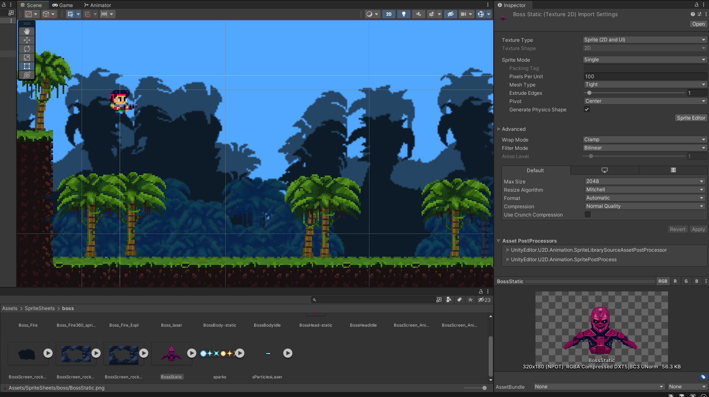

## <u>Animation</u>
This element is used to create animations from sprite. Selecting several sprites and clicking right button then Create > Animation. 
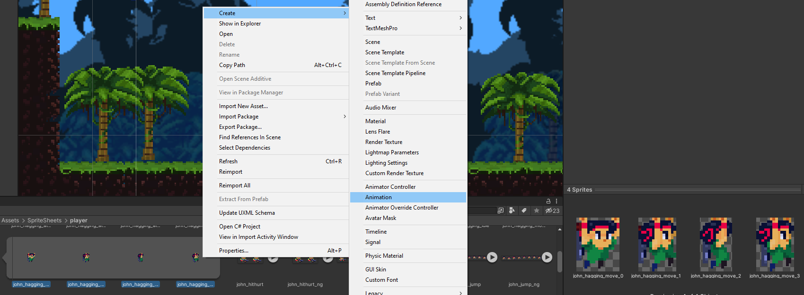

It is advisable to organize all Animation into same folder. This folder normally is used to store the Animator Controller too. 
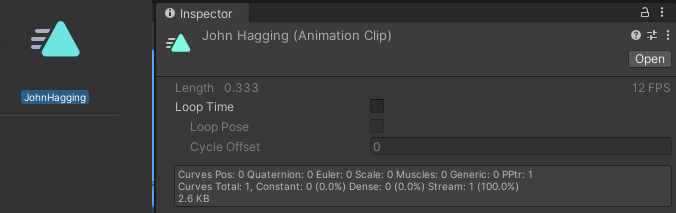

- **Loop Time**: Determines the animation is shown in loop. For continuous animation in time like run, walk, idle, etc, set the value true, for other ones like jum, grab, etc, set value false.

 

With double click on the Animation icon the Animation panel will be shown. Here it is possible watch the animation by sprite and Add event in some animation moment. For example at the last of a bullet animation call a function for destroy the object.
- **Function**: Function name
- **Object**: Script where the function is implemented

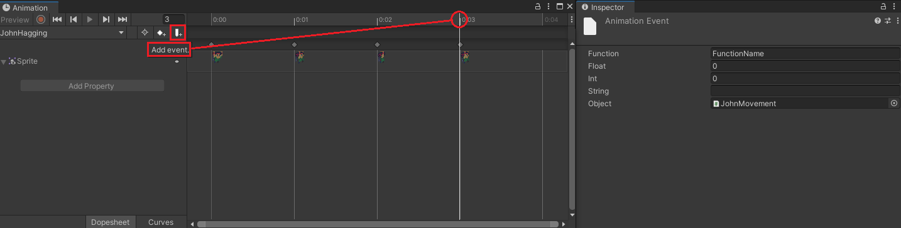

## <u>Animator Controller</u>
[Animator Controller - Unity Documentation](https://docs.unity3d.com/2021.3/Documentation/Manual/class-AnimatorController.html) 
This element manage the differents states (with Aimation associated) for a object. It is possible create a Animator Controller clicking right button then Create > Animator Controller, althouhg other way is drag and drop a Animation element into object to create a Animator component. 
Like with Animation is advisable to organize all Animator Controller into same folder. This folder normally is used to store the Animation too. 
With double click on Animator Controller icon the Animator panels appears, showing the Animator states and transitions.

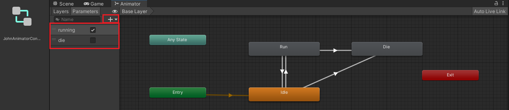

It is possible create variable to manage the transition between states. 
Clicking in a state it is possible check the Animation (**Motion**) assigned to the state

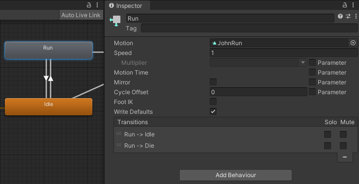

Clicking in a tansiton (is created with right button on state and Make Transition), can be detemined the parameter values for change the state

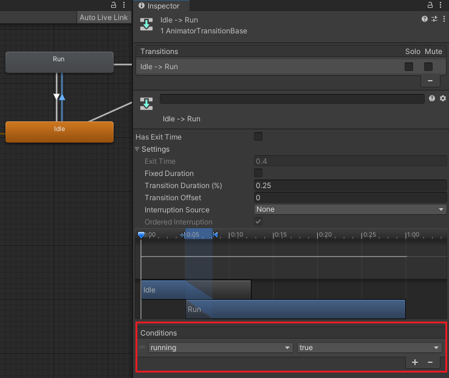

Has Exit Time and Settings > Fixed Duration should be unchecked to avoid transition problems:
- **Has Exit Time**: Trasition has a fixed exit time
- **Fixed Duration**: Transition duration is independent of state length
- **Transition Duration**: Set the duration for the transition. For Sprites in pixel art the right value is 0

  

# 4. Unity Object Components
Components are added to a scene object and used to build the object type in the game.

## <u>Transform</u>
[Transform - Unity Documentation](https://docs.unity3d.com/2021.3/Documentation/Manual/class-Transform.html) 
Main component, all object contains this component and is used to get/set the position, rotation and scale of the object.

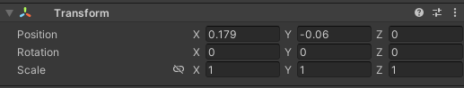

## <u>Sprite Renderer</u>
[Sprite Renderer - Unity Documentation](https://docs.unity3d.com/2021.3/Documentation/Manual/class-SpriteRenderer.html) 
Component assigned to print a sprite into the scene. If drag and drop into the scene an sprite, automatically a new object is created with the Transform, Sprite Renderer components. 

- **Sprite**: Image assigned to the component.
- **Color**: Componet color.
- **Flip**: Turn the image by axis (x o y)
- **Aditional Setting > Orden in Layer**: Determines the sprite position (in fron of or behind) in the scene
- **Flip**: X and Y use to flip the sprite according axis
- **Sorting Layer**: Layer that the object is included
- **Order in Layer**: Object order in his layer

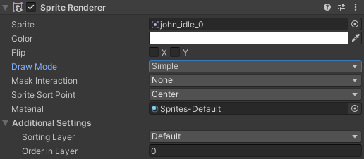

## <u>Rigidbody 2D</u>
[Rigidbody 2D - Unity Documentation](https://docs.unity3d.com/2021.3/Documentation/Manual/class-Rigidbody2D.html) 
A Rigidbody 2D component places an object under the control of the physics engine. Many concepts familiar from the standard Rigidbody component carry over to Rigidbody 2D; the differences are that in 2D, objects can only move in the XY plane and can only rotate on an axis perpendicular to that plane. 
Let place the object into the scene with physics. Can be setted with velocity for example. The ground for example is a object wihtout Rigidbody because It not will be moved.

- **Gravity Scale**: How much gravity affects this body.
- **Mass**: Object mass that affect to the force interaction.
- **Linear Drag**: Indicates how to fast work his decelerate forces.
- **Angular Drag**: Indicates how to fast work his decelerate rotate forces.
- **Collision Detection**: Can be calculate frame to frame (discrete) or check if between frame there was some object (continius)
- **Constraints > Freez Rotation**: To fixed the rotation in some axis if is necessary.

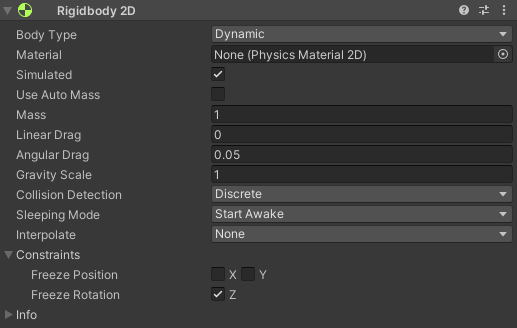

## <u>Capsule Collider 2D</u>
[Capsule Collider 2D - Unity Documentation](https://docs.unity3d.com/2021.3/Documentation/Manual/class-CapsuleCollider2D.html) 
The Capsule Collider 2D is a Collider that interacts with the 2D physics system. The capsule shape has no vertex corners and has a continuous round circumference. This shape allows the Capsule Collider 2D to not get easily caught in the corners of other Colliders. The capsule shape is considered solid and not hollow, which means any other Collider 2Ds that are inside the Capsule Collider 2D are considered to be in contact with the Collider and are forced out of it over time.

- **Edit Collider**: Better option to adjust the collider to the object.
- **Is Trigger**: Activated, other colliders no are blocked with it.

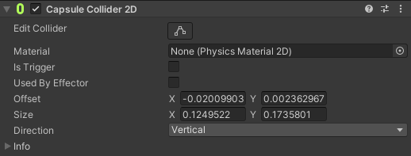

## <u>Animator</u>
[Animator - Unity Documentation](https://docs.unity3d.com/2021.3/Documentation/Manual/class-Animator.html) 
Component to assign animation to the object (with **Controller**)

- **Controller**: Set the Animator Controller elmenent that define the states with his animations.
- **Avatar**: Used with humanoid objects

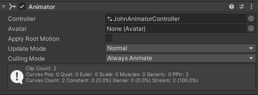

  

# 5. C# in Unity
## <u>Public Variables</u>
It is possible create public variable in the script associated to a object. Theses variables can be modyfied from editor inclusive with the game running. Normally are used to:
- Test de variable value in game (screen in red).
- Assign a scene object to the script. It let get the object assigned properties inside the another object script (screen in green).

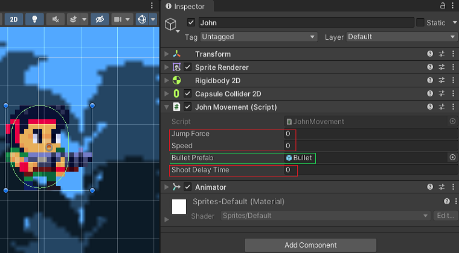 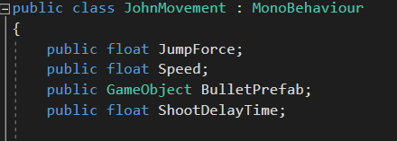

 

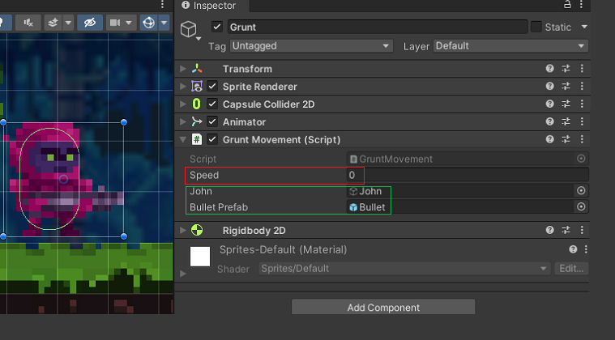 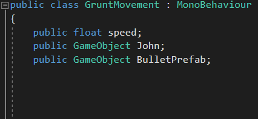

  

# 6. CheatSheet
## 6.1. Examples
### Parallax
Parallax is a beatiful effect used to gain deep in the scene. Consist in the background movement with the player / cam movement.
It is based in a youtube video tutorial:

[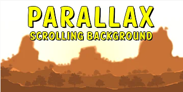](https://www.youtube.com/watch?v=zit45k6CUMk&t=10s)

- The key is, each background part should be in a different layer and the paint musft finish and start at the same place.
- Create a empty object into the scene's camera. Call it "Background", drag and drop the images for the parallax background. Order the layers:

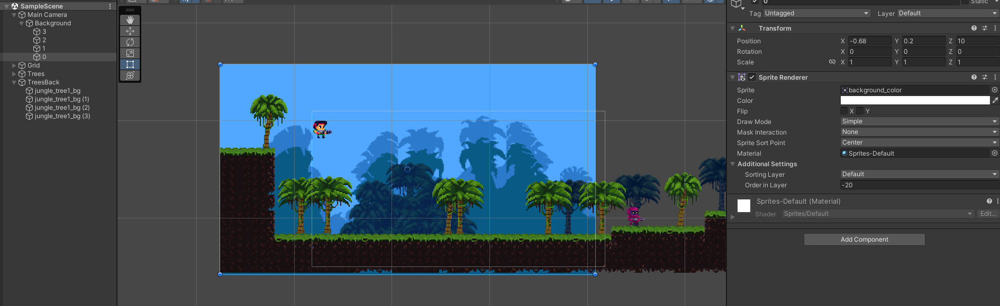

- Now coy twice the differents parts into "Background" object created, and concatenate the bunch of differents parts.

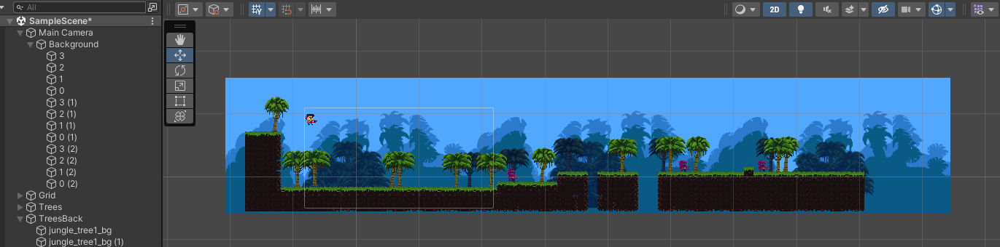

- Create a C# file to create the parallax behaviour. The tric here is create a different offsets in the movement for different background parts. And remove the bunch of background to have infinite background effect.

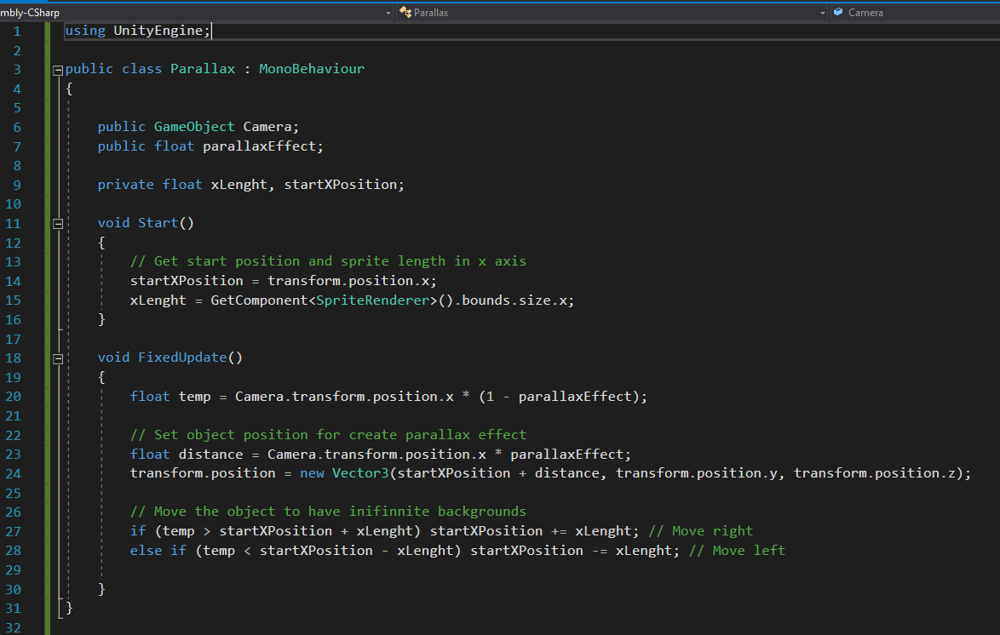

- Reagroup the differents backgrounds and assign the script all of them.
- Now add the camera like component and set the "parallaxEffect" value. For the parallax effect give minor value to the nearest backgrounds and greater values to the farest backgrounds.
  -  Close to 0 the movement will be near static
  -  Close to 1 but under it, the movement will be close to the camera movement
  -  Upper 1 the movemnt will be faster than the camera

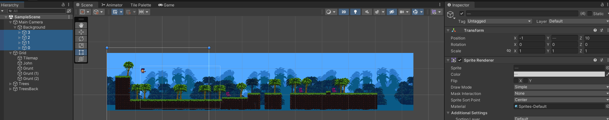

  

### Melee Combat
The first obstacle found in Unity when start to create a game is the control and interaction between scene objects. It is a example for melee basic combat.
It is based in a youtube video tutorial:

[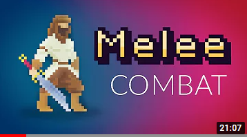](https://www.youtube.com/watch?v=sPiVz1k-fEs)

It is suppose you have a scene with a player and a enemy, who will be hitted. The player movement is implemented previously.

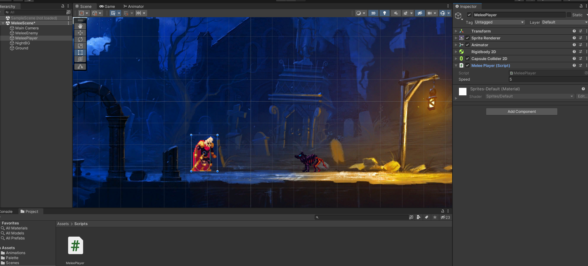

- Add a new C# file to implement the combat behaviour on the player. And comment what do you want to do (to organizate):
  - Animation
  - Detect objects
  - Effect on objects

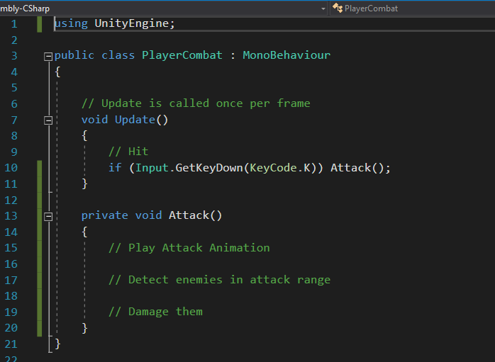

- The player can attack from any state. It is necessary add a new Animation for the player attack. To change the animation use a trigger (called attack)

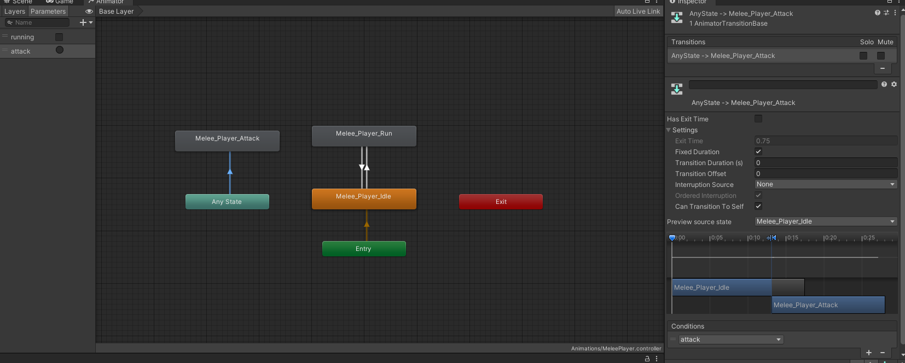
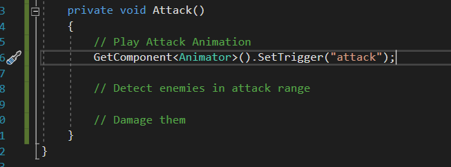
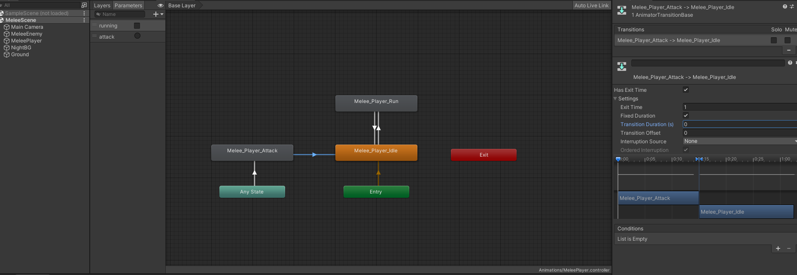

- Nex step is detect the enemies. To do this, is necessary some variables like:
  - Hit point. In the space it is necessary set the hit position. In player, create a empty object called "AttackPoint", and move this to the weapon range attack. In the C# file will be necessary add a public Transform variable to set the "AttackPoint" reference to the PlayerCombat script.
  - Attack range. It is good idea will be a public float variable to adjust the range executing the game.
  - Objects affected. In this case, all enemies. It usefull the layers here (LayerMask class).

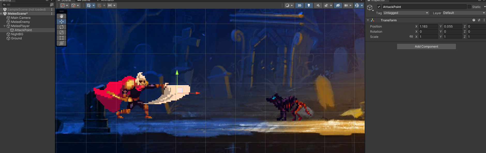
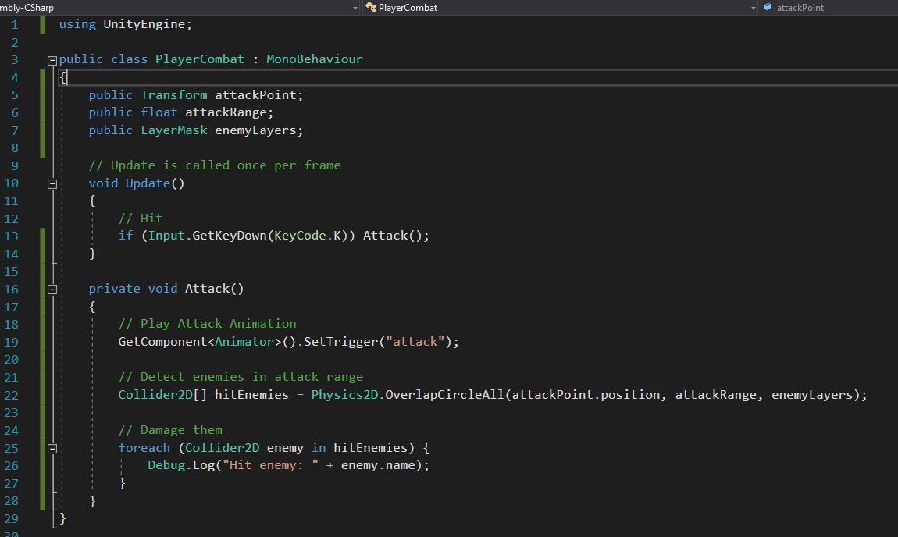
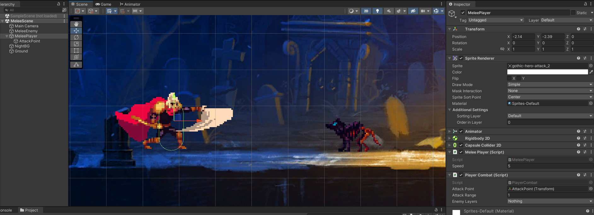

- Like not is possible see the range of the AttackPoint, is usefull use OnDrawGizmoSelected function to draw the range of the attack point.
- In the inspector, with the enemy object selected, can asign a layer previously created or created a new to assign (like Enemies). And set this layer into the script public variable to determinate that the objects in Enemies layer can be attacked (by Attack() function)

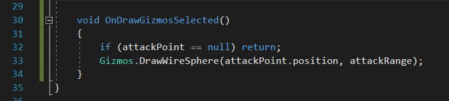
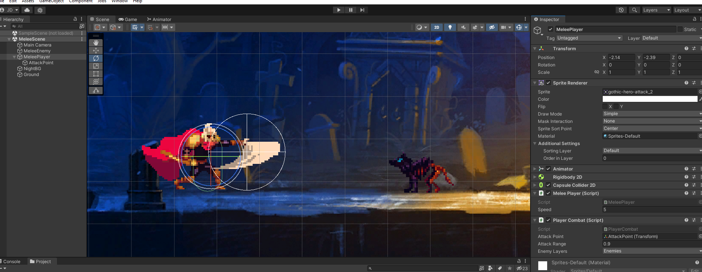

- In this point, the melee combat main idea is completed. Now it is possible add HP to the enemies, damage point, or whatever you want. To give behaviour to the enemies it is necessary add a C# file and animations (hurt, die, etc). After enemy die, will be necessary disable the object. In my case with one hit the enemy is defeated and at the end of the "die" animation call a event to destroy the object.

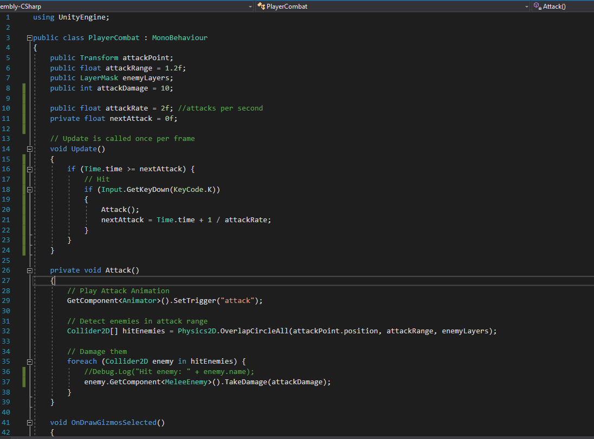
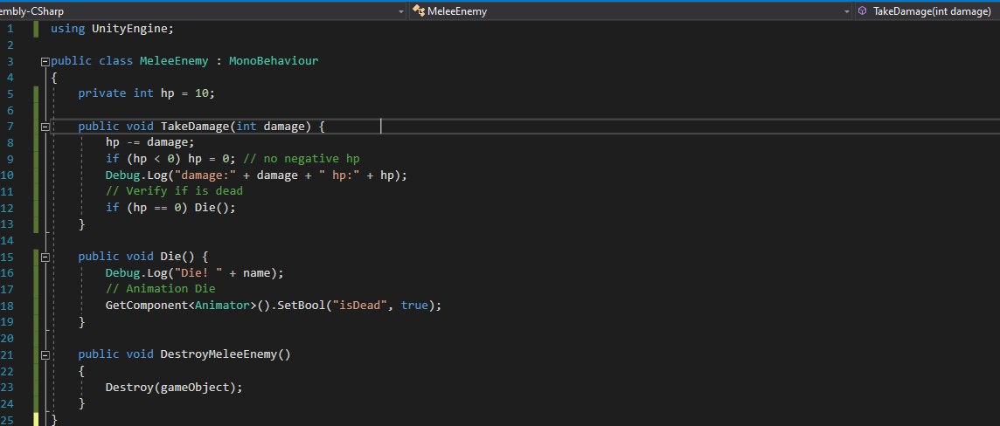
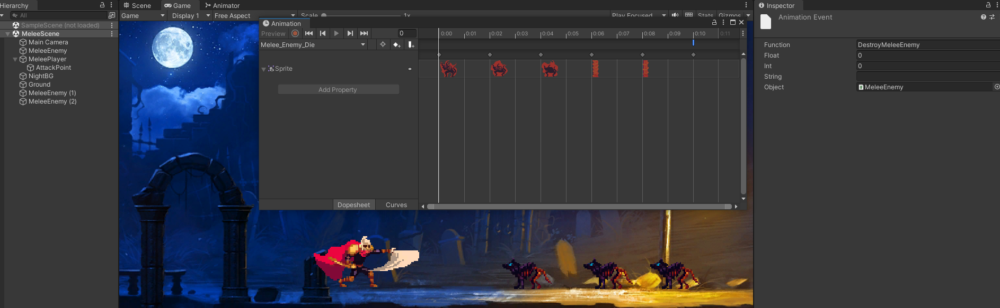

- Is usefull use debug mode in Unity in the inspector section to review the variables, on the top right.

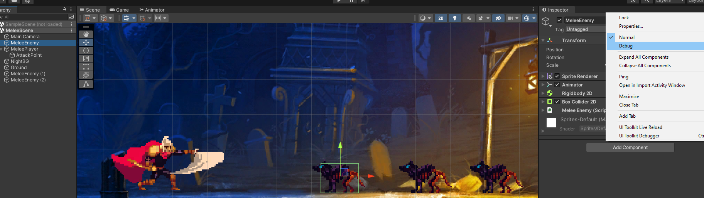

 

## 6.2. Relevant Functions
Key | Description
:-------:|------------
OnCollisionEnter2D | RigidBody2D function called always the RigidBody touch other RigidBody
OnTriggerEnter2D | Collider2D function called always the Collider touch other Collider
Destroy | Function to delete the object passed in param 
Instantiate | Function to create a Prefab instance
DontDestroyOnLoad | Funtion to avoid the object will be destroyed when the scene end
OverlapCircleAll | Physic2D function used to create a circle in the object position setted by parameter, range setted and objects to detec too. Returns the array object's collider detected.

## 6.3. Hot Keys
Key | Description
:-------:|------------
Crtl+R+R | Refactor
Ctrl+D | Duplicate object selected