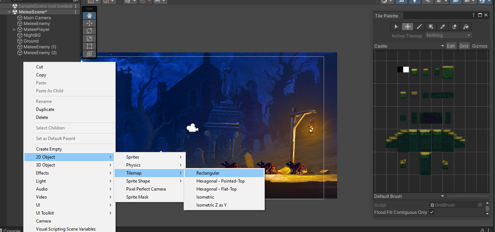

# Unity guide
A bunch of Unity examples to play and test the engine elements and tools. Documentation and cheatsheet.

# Introduction 
Unity is the most popular video game engine. Reason:
- **Free**: It is free at 100k€ of benefist
- **Easy**: No much dificult to learn and use a extended programming language (C#)
- **Versatile**: It is possible build 2D and 3D games

# Table of Content

- [Unity guide](#unity-guide)
- [Introduction](#introduction)
- [Table of Content](#table-of-content)
- [1. Install Unity](#1-install-unity)
- [2. Unity Workspace](#2-unity-workspace)
  - [<u>Project Settings</u>](#uproject-settingsu)
    - [Physics 2D](#physics-2d)
- [3. Unity Engine Elements](#3-unity-engine-elements)
  - [<u>User Interface (UI)</u>](#uuser-interface-uiu)
  - [<u>Scenes</u>](#uscenesu)
  - [<u>Sprite</u>](#uspriteu)
  - [<u>Animation</u>](#uanimationu)
  - [<u>Animator Controller</u>](#uanimator-controlleru)
  - [<u>Tiles Map / Tiles palette</u>](#utiles-map--tiles-paletteu)
  - [<u>Prefabs</u>](#uprefabsu)
- [4. Unity Object Components](#4-unity-object-components)
  - [<u>Common properties</u>](#ucommon-propertiesu)
  - [<u>Transform</u>](#utransformu)
  - [<u>Sprite Renderer</u>](#usprite-rendereru)
  - [<u>Rigidbody 2D</u>](#urigidbody-2du)
  - [<u>Capsule Collider 2D</u>](#ucapsule-collider-2du)
  - [<u>Animator</u>](#uanimatoru)
  - [<u>Camera</u>](#ucamerau)
  - [<u>Audio Source</u>](#uaudio-sourceu)
- [5. C# in Unity](#5-c-in-unity)
  - [<u>Public Variables</u>](#upublic-variablesu)
  - [<u>Inside object's script</u>](#uinside-objects-scriptu)
  - [<u>Relevant classes</u>](#urelevant-classesu)
  - [<u>Singletons</u>](#usingletonsu)
- [6. CheatSheet](#6-cheatsheet)
  - [6.1. Examples](#61-examples)
    - [Parallax](#parallax)
    - [Melee Combat](#melee-combat)
  - [6.2. Relevant Functions](#62-relevant-functions)
  - [6.3. Hot Keys](#63-hot-keys)

   

# 1. Install Unity

# 2. Unity Workspace
The unity workspace is composed by several windows and sections. It can be customized, but by default contains:

- **Hierarchy**: Project hierarchy. Contains the scenes, objects, elements of the project.
- **Scene**: Show the scene elments in a space
- **Game**: Window where is shown the game execution
- **Animator**: Windows to work with the Animatior Controller elements, that contains the object animations and states.
- **Inspector**: Show the object componentes (properties)
- **Project**: It is the project browser
- **Console**: Unity console, used to get report regarding game information, warnings or errors.

## <u>Project Settings</u>
From Edit>Project Setting it is possible change multiple project properties and features:
### Physics 2D
- **Gravity**: Force applied to all rigid bodies. By default is -9.81 in Y axis, but it is possible modify this in X and Y axis (remember physics 2D section)

# 3. Unity Engine Elements
Elements compose a bunch of features to build the game but no are part of the object.

## <u>User Interface (UI)</u>
In Unity the UI is a engine element with many subelements, and is printed over scene. 
To create a UI element, in the Hierachy section (or on a camera if the camera follow the player) Right Click > UI and select the element.

## <u>Scenes</u>
The scenes are the game sections, are used to divide like stages, zones, etc. The scenes contains the gameObjects. By default a main scene is exectued when the game run. 
From File > Build Setting it is possible manage the differents scenes in the game. 
To load a scenes from script use **SceneManager.LoadScene("SceneName")**. Becareful because must import the scene manager to use that (**using UnityEngine.SceneManagement**).

## <u>Sprite</u>
Is a image resource used in the project. The sprites can be used to create animations, background, etc. 
Selecting a sprite in Unity browser is possible check his parameters. 
If drag and drop into the scene an sprite, automatically a new object is created with the Transform, Sprite Renderer components. 

- **Texture Type**: Indicates for what will be used the sprite.
- **Sprite Mode**: Determines the if the sprite is single or composed sprite.
- **Pixels Per Unit**: Determines the sprite size in the scene.
- **Sprite Edtior**: Used to adjust the sprtie or divide composed sprite (Slice > Method > Smart).
- **Filter Moder**: Set a softened type to the sprite (pointer is pixel-art).

## <u>Animation</u>
This element is used to create animations from sprite. Selecting several sprites and clicking right button then Create > Animation. 

It is possible too create animations from Animation tab, record button and adding the sprites for the animation (**TODO: add image**). 
It is advisable to organize all Animation into same folder. This folder normally is used to store the Animator Controller too.

- **Loop Time**: Determines the animation is shown in loop. For continuous animation in time like run, walk, idle, etc, set the value true, for other ones like jum, grab, etc, set value false.

 

With double click on the Animation icon the Animation panel will be shown. Here it is possible watch the animation by sprite and Add event in some animation moment. For example at the last of a bullet animation call a function for destroy the object.
- **Function**: Function name
- **Object**: Script where the function is implemented

## <u>Animator Controller</u>
[Animator Controller - Unity Documentation](https://docs.unity3d.com/2021.3/Documentation/Manual/class-AnimatorController.html) 
This element manage the differents states (with Aimation associated) for a object. It is possible create a Animator Controller clicking right button then Create > Animator Controller, althouhg other way is drag and drop a Animation element into object to create a Animator component. 
Like with Animation is advisable to organize all Animator Controller into same folder. This folder normally is used to store the Animation too. 
With double click on Animator Controller icon the Animator panels appears, showing the Animator states and transitions.

It is possible create variable to manage the transition between states. With right click on state it isp possible set the state like default. 
Clicking in a state it is possible check the Animation (**Motion**) assigned to the state

Clicking in a tansiton (is created with right button on state and Make Transition), can be detemined the parameter values for change the state

Has Exit Time and Settings > Fixed Duration should be unchecked to avoid transition problems:
- **Has Exit Time**: Trasition has a fixed exit time
- **Fixed Duration**: Transition duration is independent of state length
- **Transition Duration**: Set the duration for the transition. For Sprites in pixel art the right value is 0

## <u>Tiles Map / Tiles palette</u>
A Tile Map is a element used like library of sprite, usually to create environment elments. It is created normally from a spritesheet (a multy sprite). When is created, it is possible access to the map like Tiles Palette.

- Go to Window > 2D > Tile Palette, a new tab will be open. "Create New Palette" and set the name (like Castle in the image)

- Get a spritesheet to get multiple sprites, setting multiple and clicking in sprite editor to define the sprites.
- After that, drag and drop the srpritesheet modified into the Palette tab.

- With Edit, Select and Move buttons, it is possible reorganize the palette.
- To use the palette in the scene it is necessary create a object. For this, Right Click > 2D Object > Tile Map > Rectangular. With this the Tile Map is created, where can be use the Tile Palette.

- The Grid object created has a component Grid where is very important set the cell size with the same size of the sprites in the palette. In the example below the grid and sprite size not is the exactly the same.

- If use the Tile Map to create ground for example will be necessary add colliders. For add colliders to each sprite in the Tile Palette, add to the **Tile Map** object the componente **Tilemap Collider**.
- The last point can be generate problems, for get many colliders, in this point better get only one collider composed by all Tile Palette sprites. For do this, add to the **Tile Map** object another component called **Composite Collider**. This action add a RigidBody component too. And for all works correctly must check **Used By Composite** property in **Tilemap Collider** and in the **RigidBody** set static y **Body Type**.

  

## <u>Prefabs</u>
An prefab is a object file. It is a scene object that is "exported" like an Unity engine element to be used in any scene of the game. 
The prefabs are used when it is necessary instance multiple times a object. All prefabs instances are linked. 
Each prefab instance has a Tag section, so, if some instance get a change, this change can be applied to the prefab "parent". 

Create a prefab is easy. Only doing drag and drop of the scene object, to the project explorer.

The objects position are relative to his parent, for this reason, when prefabs instances are added to the scene, it is good idea use a parent container to reference the prefabs position.  
The parent object of a object can be obtained using **transform.parent.gameObject**.

  

# 4. Unity Object Components
Components are added to a scene object and used to build the object type in the game.

## <u>Common properties</u>
Every object in the scene has some properties regardless of the object type.

- **Tag**: Property used to group scene object for some property o feature. There are default tags and it is possible create another ones.
- **Layer**: Property used to group the object layer in the scene, usefull in 2D games. Like the tags, there are default layers and it is possible create another ones

## <u>Transform</u>
[Transform - Unity Documentation](https://docs.unity3d.com/2021.3/Documentation/Manual/class-Transform.html) 
Main component, all object contains this component and is used to get/set the position, rotation and scale of the object.

## <u>Sprite Renderer</u>
[Sprite Renderer - Unity Documentation](https://docs.unity3d.com/2021.3/Documentation/Manual/class-SpriteRenderer.html) 
Component assigned to print a sprite into the scene. If drag and drop into the scene an sprite, automatically a new object is created with the Transform, Sprite Renderer components. 

- **Sprite**: Image assigned to the component.
- **Color**: Componet color.
- **Flip**: Turn the image by axis (x o y)
- **Aditional Setting > Orden in Layer**: Determines the sprite position (in fron of or behind) in the scene
- **Flip**: X and Y use to flip the sprite according axis
- **Sorting Layer**: Layer that the object is included. It is possible define layers to group the different scene objets (seleccting "Add Sorting Layer"). The layers are printed from up to down, use this to organize the scene layers
- **Order in Layer**: Object order in his layer

## <u>Rigidbody 2D</u>
[Rigidbody 2D - Unity Documentation](https://docs.unity3d.com/2021.3/Documentation/Manual/class-Rigidbody2D.html) 
A Rigidbody 2D component places an object under the control of the physics engine. Many concepts familiar from the standard Rigidbody component carry over to Rigidbody 2D; the differences are that in 2D, objects can only move in the XY plane and can only rotate on an axis perpendicular to that plane. 
Let place the object into the scene with physics. Can be setted with velocity for example. The ground for example is a object wihtout Rigidbody because It not will be moved.

- **Gravity Scale**: How much gravity affects this body.
- **Mass**: Object mass that affect to the force interaction.
- **Linear Drag**: Indicates how to fast work his decelerate forces.
- **Angular Drag**: Indicates how to fast work his decelerate rotate forces.
- **Collision Detection**: Can be calculate frame to frame (discrete) or check if between frame there was some object (continius)
- **Constraints > Freez Rotation**: To fixed the rotation in some axis if is necessary.

## <u>Capsule Collider 2D</u>
[Capsule Collider 2D - Unity Documentation](https://docs.unity3d.com/2021.3/Documentation/Manual/class-CapsuleCollider2D.html) 
The Capsule Collider 2D is a Collider that interacts with the 2D physics system. The capsule shape has no vertex corners and has a continuous round circumference. This shape allows the Capsule Collider 2D to not get easily caught in the corners of other Colliders. The capsule shape is considered solid and not hollow, which means any other Collider 2Ds that are inside the Capsule Collider 2D are considered to be in contact with the Collider and are forced out of it over time.

- **Edit Collider**: Better option to adjust the collider to the object.
- **Is Trigger**: Activated, other colliders no are blocked with it.

## <u>Animator</u>
[Animator - Unity Documentation](https://docs.unity3d.com/2021.3/Documentation/Manual/class-Animator.html) 
Component to assign animation to the object (with **Controller**)

- **Controller**: Set the Animator Controller elmenent that define the states with his animations.
- **Avatar**: Used with humanoid objects

  

## <u>Camera</u>
This component let watch the game, and can be added to any object. Normally in empty objects to use "like camera".

- **Background**: Determines the background color
- **Size**: Determines the vertical size

  

## <u>Audio Source</u>
Component used to set sounds to the scene. The common use is add music to the scene, in this case, add the component to the scene camera. The sound files used by Unity are **.ogg**.
To convert any file to ogg format can use this free web <a href="https://audio.online-convert.com/es/convertir-a-ogg">Audio Online Converter</a>. Can preview the audio files.

Adding the component to a object can check the properties.

- **Audio Clip**: File to sound
- **Play On Awake**: Checked play the file when the object is created
- **Volume**: Determines the audio source volumne. Values between 1 (100%) and 0 (0%)

  

# 5. C# in Unity
## <u>Public Variables</u>
It is possible create public variable in the script associated to a object. Theses variables can be modyfied from editor inclusive with the game running. Normally are used to:
- Test de variable value in game (screen in red).
- Assign a scene object to the script. It let get the object assigned properties inside the another object script (screen in green).

 

 

 

 

## <u>Inside object's script</u>
- GameObject is the parent object in Unity. Has a until funfion **Find()** to search a object by name, but not is a good practice.
- Start() function is executed only one time when the object asociated is created.
- Update() function is executed each frame
- Inside the C# file of a object, it is possible access to the own object wit **gameObject**, it is similar to do **this** in Java.
- Is so usefull create a function DestroyGameObject() to the destory the object in the scene. And associate this like a event in the last sprite of an Animation.
- To get a component in the object use GetComponent<...>().
- All object have transform component, for this reason not is necessary use GetComponent to get the transform component of a object. Only type **transform**.
- The logic implemented in Update function, should be multiplied by **Time.DeltaTime** to avoid the frames dependency.
- A empty object is used to contains general scripts.
- When a C# file is created directly in the browser (and no from "Add Component" button) will be necessary  set the class name, other way, Unity doesn't found the script.

 

## <u>Relevant classes</u>
- **Input**: Used to interact with the game keys (controls). Together this is used **KeyCode** enum to get the keys.
- **Random**: To generate random numbers.
- **Quaternion**: Determines the object rotation. **Quaternion.indentity** is the initial rotation in the object.
- **Debug**: Usefull class to debug the code, using for esamel **Debug.Log** to show information in the Unity console.
- **SceneManager**: Used to manage the game scenes.

 

## <u>Singletons</u>
se hace algo diferente que en Java, es usado para acceder a funciones desde cualquier objeto/script de la escena.
The singletons must be added to the objects script like public variable bo be accesible
A singleton is a script object with a unique instance. It is used to manage features, data, etc between all scenes and objects game. Create singletons is a method used in other programming languages like Java to create services with a unique instance to provide funcions used in the application. 

In Unity the singleton script must be added to a empty object. To create the singleton script, it must contain a **public static** variable for hiself and control the creation or destruction in his **Start** method (constructor).

 

The game objects can use the functions provide by the singleton.

  

# 6. CheatSheet
## 6.1. Examples
### Parallax
Parallax is a beatiful effect used to gain deep in the scene. Consist in the background movement with the player / cam movement.
It is based in a youtube video tutorial:

- The key is, each background part should be in a different layer and the paint must finish and start at the same place.
- Create a empty object into the scene's camera. Call it "Background", drag and drop the images for the parallax background. Order the layers:

- Now coy twice the differents parts into "Background" object created, and concatenate the bunch of differents parts.

- Create a C# file to create the parallax behaviour. The tric here is create a different offsets in the movement for different background parts. And move the bunch of background to have infinite background effect.

- Reagroup the differents backgrounds and assign the script all of them.
- Now add the camera like component and set the "parallaxEffect" value. For the parallax effect give minor value to the nearest backgrounds and greater values to the farest backgrounds.
  -  Close to 0 the movement will be near static
  -  Close to 1 but under it, the movement will be close to the camera movement
  -  Upper 1 the movemnt will be faster than the camera (no use this in parallax effect)

  

### Melee Combat
The first obstacle found in Unity when start to create a game is the control and interaction between scene objects. It is a example for melee basic combat.
It is based in a youtube video tutorial:

It is suppose you have a scene with a player and a enemy, who will be hitted. The player movement is implemented previously.

- Add a new C# file to implement the combat behaviour on the player. And comment what do you want to do (to organizate):
  - Animation
  - Detect objects
  - Effect on objects

- The player can attack from any state. It is necessary add a new Animation for the player attack. To change the animation use a trigger (called attack)

- When attack animation finish, back to the idle state (the attack animation must be completely shown)

- Nex step is detect the enemies. To do this, is necessary some variables like:
  - Hit point. In the space it is necessary set the hit position. In player, create a empty object called "AttackPoint", and move this to the weapon range attack. In the C# file will be necessary add a public Transform variable to set the "AttackPoint" reference to the PlayerCombat script.
  - Attack range. It is good idea will be a public float variable to adjust the range executing the game.
  - Objects affected. In this case, all enemies. It usefull the layers here (LayerMask class).

- Like not is possible see the range of the AttackPoint, is usefull use OnDrawGizmoSelected function to draw the range of the attack point.
- In the inspector, with the enemy object selected, can asign a layer previously created or created a new to assign (like Enemies). And set this layer into the script public variable to determinate that the objects in Enemies layer can be attacked (by Attack() function)

- In this point, the melee combat main idea is completed. Now it is possible add HP to the enemies, damage point, or whatever you want. To give behaviour to the enemies it is necessary add a C# file and animations (hurt, die, etc). After enemy die, will be necessary disable the object. In my case with one hit the enemy is defeated and at the end of the "die" animation call a event to destroy the object.

- Is usefull use debug mode in Unity in the inspector section to review the variables, on the top right.

 

## 6.2. Relevant Functions
Key | Description
:-------:|------------
OnCollisionEnter2D | RigidBody2D function called always the RigidBody touch other RigidBody
OnTriggerEnter2D | Collider2D function called always the Collider touch other Collider
Destroy | Function to delete the object passed in param 
Instantiate | Function to create a Prefab instance
DontDestroyOnLoad | Funtion to avoid the object will be destroyed when the scene end
OverlapCircleAll | Physic2D function used to create a circle in the object position setted by parameter, range setted and objects to detec too. Returns the array object's collider detected
Translate | Transform function to translate the object to another position
AddForce | RigidBody2D function to apply a force to the object
LoadScene | SceneManager function to load a scene by name

## 6.3. Hot Keys
Key | Description
:-------:|------------
Crtl+R+R | Refactor
Ctrl+D | Duplicate object selected